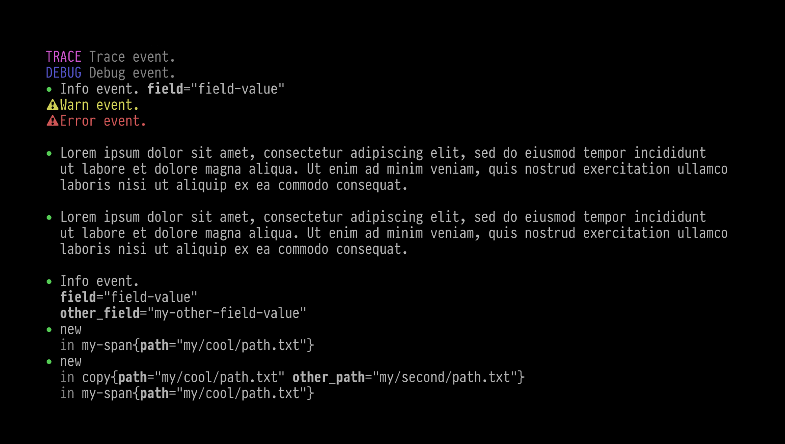

# tracing-human-layer

<a href="https://docs.rs/tracing-human-layer/latest/tracing_human_layer/"></a>
<a href="https://crates.io/crates/tracing-human-layer"></a>

A human-friendly and colorful terminal output
[`tracing_subscriber::Layer`][layer] for [`tracing`][tracing].

Features:

- Line-wrapping ([optional][textwrap])
- Colorful output ([customizable][styles] and [optional][disable-color])
- Blank lines between long log messages
- One-line format for short log messages with one short field



## Quick start

```rust
use tracing_human_layer::HumanLayer;

tracing_subscriber::registry()
  .with(HumanLayer::new())
  .init();
```

[layer]: https://docs.rs/tracing-subscriber/latest/tracing_subscriber/layer/trait.Layer.html
[tracing]: https://docs.rs/tracing/latest/tracing/
[textwrap]: https://docs.rs/tracing-human-layer/latest/tracing_human_layer/struct.HumanLayer.html#method.with_textwrap_options "line-wrapping can be disabled or customized"
[styles]: https://docs.rs/tracing-human-layer/latest/tracing_human_layer/struct.HumanLayer.html#method.with_style_provider "output colors can be customized"
[disable-color]: https://docs.rs/tracing-human-layer/latest/tracing_human_layer/struct.HumanLayer.html#method.with_color_output "output colors can be disabled"
